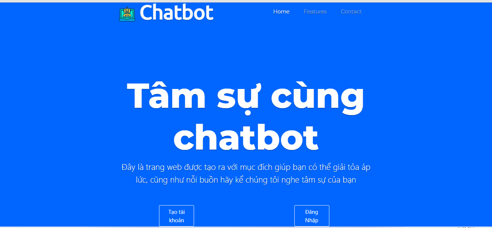
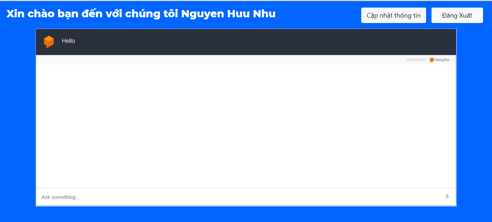

# Người Bạn-Chatbot

Ngày nay vì công việt qua bận rộn đối với chúng ta, nên nhiều lúc có thâm sự như thật sự chẳn biết nói với ai.Ý tưởng được đề xuất là tạo ra một hệ thống với Dialog Flow có thể đáp ứng các yêu cầu tâm sự của mỗi ca nhân. Chatbot tâm sư giúp chung ta có thể trò chuyện như 1 người bạn thực. Lợi ích thực sự của chatbot là cung cấp lời khuyên và thông tin cho một cuộc sống lành mạnh. Nhằm giảm tải tâm sự và giúp con người tránh khỏi stress trong công việc cũng như là đời sống. Chatbot sẽ trả lời một cách hài hước nhật để giúp tâm lý của bạn có thể thư giãn hơn.
**Start Page**

**Login Page (Screenshot of Errors When Directly Clicked the 'Sign In' Button)**

**Registration Page**

**Chat Page**

